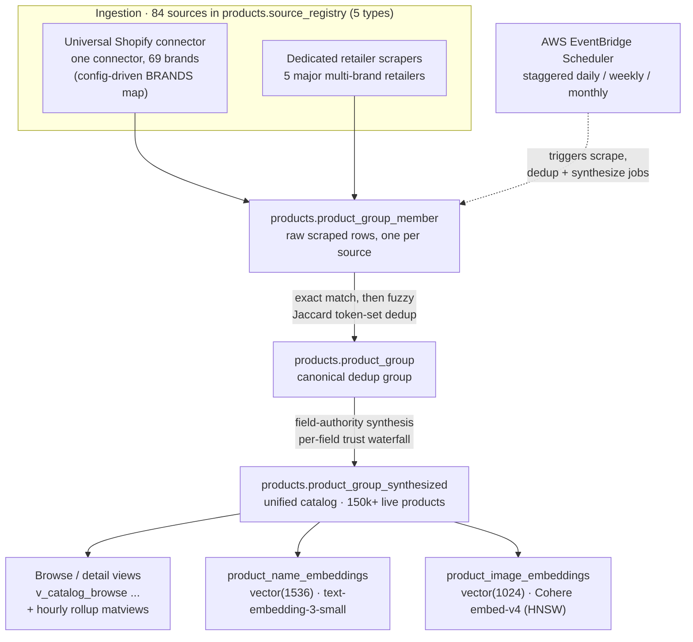
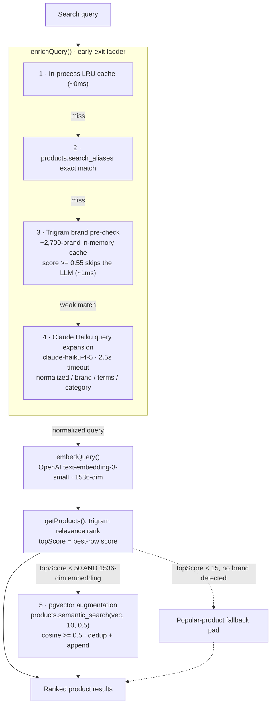
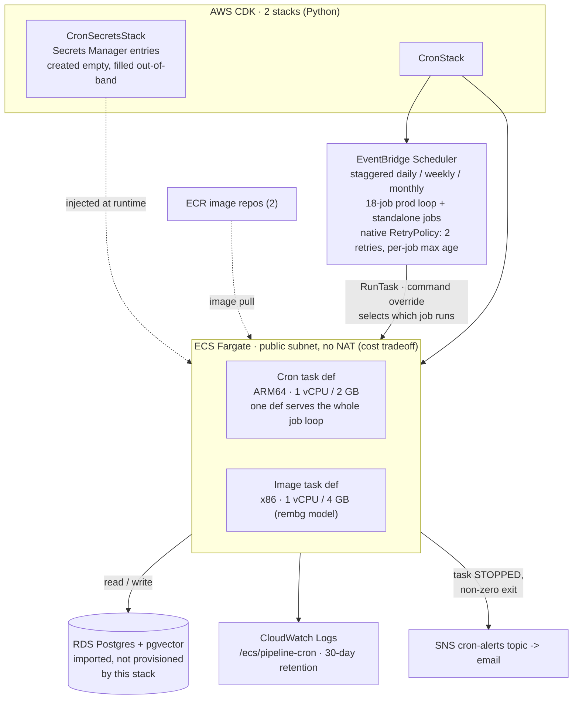

# Multi-Source Catalog ETL + Semantic Search

## 1. Multi-source ETL to a unified catalog

Data comes in from 84 registered sources (tracked in a `products.source_registry` table, typed as brand-direct, brand-storefront, retailer, aggregator, or search-harvest). Shopify-based brands share a single config-driven connector rather than one scraper each; a handful of large multi-brand retailers have dedicated scrapers. Raw rows land in `product_group_member`, get deduplicated into canonical `product_group` rows, and are then synthesized into one clean row per product.



Deduplication is the load-bearing step. After an exact-match pass it runs a fuzzy pass that tokenizes each normalized product name, strips retailer catalog-ID suffixes and low-signal stop words, and compares token sets by Jaccard similarity:

```python
def _product_tokens(normalized_name: str) -> frozenset:
    """Tokenize a pre-normalized product name for fuzzy comparison.
    Strip punctuation, drop trailing SKU-style all-digit suffixes,
    apply US/UK spelling normalization, remove low-signal stop words.
    """
    tokens = re.sub(r'[^a-z0-9 ]', '', normalized_name.lower()).split()
    while tokens and re.fullmatch(r'\d{5,}', tokens[-1]):   # drop catalog IDs
        tokens.pop()
    return frozenset(
        _US_UK_MAP.get(t, t) for t in tokens if t not in _FUZZY_STOPWORDS
    )

def _jaccard(tokens_a: frozenset, tokens_b: frozenset) -> float:
    if not tokens_a or not tokens_b:
        return 0.0
    return len(tokens_a & tokens_b) / len(tokens_a | tokens_b)
```

Once products are grouped, a field-authority synthesis step picks one canonical value per field (name, price, category, images) using a per-source trust waterfall, and writes the result to `product_group_synthesized`. That synthesized table is what every view, matview, and embedding keys off of.

## 2. Layered semantic search

The search API answers a query through an early-exit ladder: each cheap stage that can resolve the query returns immediately, and only genuinely ambiguous queries reach the expensive stages. The design goal is to spend an LLM call and a vector search only when the cheaper signals are not confident.



The five stages:

1. **In-process LRU cache** returns a previously enriched query in roughly zero milliseconds.
2. **Alias table** (`products.search_aliases`) resolves known misspellings to a canonical term with a single indexed lookup.
3. **Trigram brand pre-check** fuzzy-matches the query against an in-memory cache of every known brand (~2,700). A strong match (score ≥ 0.55) means it is a brand query, so it returns without ever calling the LLM. Haiku costs seconds on a cold hit; this costs about a millisecond.
4. **Claude Haiku expansion** handles what is left (categories, ingredients, natural language). It returns a normalized name, brand, keyword terms, and category as JSON, behind a 2.5-second timeout so a slow model call can never hang the request.
5. **pgvector augmentation** only fires when the cheaper trigram ranking is not confident. The trigger and the vector call are deliberately narrow:

```ts
// dao/products.dao.ts: semantic augmentation kicks in only when trigram
// confidence is low AND a valid query embedding exists.
if (queryEmbedding && queryEmbedding.length === 1536 && topScore < 50) {
  const vectorResults = await pool.query(
    `SELECT group_id, similarity FROM products.semantic_search($1::vector, $2, $3)`,
    [`[${queryEmbedding.join(',')}]`, 10, 0.5]   // top 10, cosine >= 0.5
  );
  // dedup against the trigram rows, then append the genuinely new matches
}
```

If even that leaves the top score very low and no brand was detected, the result is padded with popular products so the shopper never sees an empty page. Every stage degrades gracefully: if OpenAI is unavailable the query runs trigram-only; if the `semantic_search` function is missing on an environment the augmentation is skipped silently.

## 3. AWS infrastructure (CDK)

The pipeline runs unattended on AWS rather than from any single developer machine, defined as two CDK stacks in Python. The design bias throughout is "simplest thing that works," with the cost tradeoffs written into the stack docstrings so the reasoning survives.



Design decisions worth calling out:

- **One task definition, one job loop.** The production pipeline is an 18-entry job list driven through a single loop: every job runs the same container image on the same Fargate task definition, and EventBridge Scheduler injects the job name as a command override to pick which one runs. A handful of standalone schedules (image processing, tiered retailer refreshes, freshness checks) sit alongside it, and the whole set is mirrored into staging and dev environments from the same code. No per-job Lambda or task-def sprawl.
- **No queue.** There is deliberately no SQS or Step Functions layer. EventBridge Scheduler targets ECS `RunTask` directly, and retry/backoff is the scheduler's own native `RetryPolicy`:

```python
retry_policy=scheduler.CfnSchedule.RetryPolicyProperty(
    maximum_event_age_in_seconds=job.max_event_age_s,   # widened per-job when useful
    maximum_retry_attempts=2,
),
```

- **Secrets never enter CloudFormation.** The CDK creates empty Secrets Manager entries; a separate bootstrap script populates the real values out-of-band, so secret material is never in a template and rotation is a plain `update-secret`, not a redeploy.
- **Documented cost tradeoffs.** Fargate runs in public subnets with no NAT Gateway (saves ~$32/mo), which is a deliberate, reversible choice recorded in the stack docstring: the alternative (a NAT Gateway, or re-creating the SecretsManager/ECR/Logs VPC interface endpoints) is spelled out so a future compliance need is a one-line switch, not an archaeology project.
- **Failure is loud.** An ECS task-state-change rule catches any task that stops with a non-zero exit and publishes to an SNS topic that emails an alert.

## Data model

The catalog is a three-layer collapse from many raw rows to one clean product:

| Table / view | Role |
|---|---|
| `products.source_registry` | The 84 ingestion sources, typed by `source_type` |
| `products.product_group_member` | Raw scraped rows, one per source that carries the product |
| `products.product_group` | Canonical dedup group (many members collapse to one group) |
| `products.product_group_synthesized` | One field-authority-synthesized row per group: the unified catalog |
| `products.v_catalog_browse` and sibling views | Browse and detail projections over the synthesized table |
| `products.rollup_category_counts`, `rollup_facet_counts` | Hourly-refreshed matviews for facet and category counts |
| `products.product_name_embeddings` | `vector(1536)` text embeddings (OpenAI), keyed to the synthesized row |
| `products.product_image_embeddings` | `vector(1024)` image embeddings (Cohere embed-v4), HNSW-indexed |

Every embedding, view, and rollup keys off `group_id`, so the whole system has exactly one notion of "a product."

## Stack

TypeScript / Node (Express) search API on Postgres (RDS) with the pgvector extension. Python ETL pipeline (scrapers, deduplication, synthesis, embedding generation). OpenAI `text-embedding-3-small` for text vectors, Cohere `embed-v4` for image vectors, Claude Haiku for query expansion. Infrastructure as AWS CDK (Python): ECS Fargate, RDS, Secrets Manager, EventBridge Scheduler, SNS, CloudWatch, ECR.

## Status

Built and operated solo under NerdJoy LLC. Two-repo split: a TypeScript API and a Python data pipeline (scraping, dedup, synthesis, embeddings, and the CDK infrastructure).

This is an architecture overview of a live production system. The full source lives in a private repository. I'm happy to walk through the code in detail on request.
